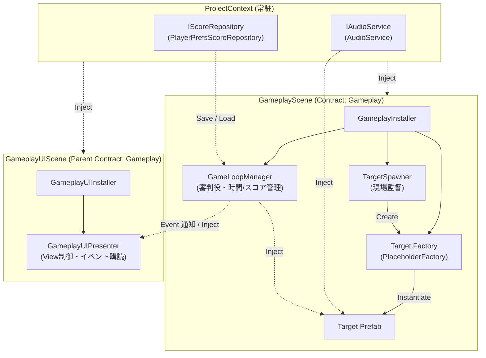

# TargetBlaster3D

3D空間に出現するターゲットをクリックして破壊し、制限時間内にハイスコアを目指すシンプルな3Dシューティングゲームです。  
**Unity 6** および **Extenject (Zenject)** を用いた疎結合なアーキテクチャ（マルチシーンDI、Factoryパターン、MVP/Presenterパターン）の実践サンプルとして構築されています。

---

## 🎮 ゲーム概要

- **制限時間**: 30秒
- **ルール**:
  - ランダムな3D空間に次々と出現するターゲットをマウスクリックで撃破
  - ターゲットを1体撃破するごとに **100点** 獲得 ＆ 効果音再生
  - 制限時間終了でゲームオーバーとなり、自己ベストスコア（ハイスコア）が自動保存・更新

---

## 🛠 開発環境・使用技術

| 項目 | バージョン / 内容 |
|---|---|
| **Unity** | `6000.3.19f1` (Unity 6) |
| **Render Pipeline** | Universal Render Pipeline (URP 17.3.0) |
| **DI Framework** | [Extenject (Zenject)](https://github.com/starikcetin/Extenject) `9.1.0` |
| **UI** | TextMeshPro (uGUI) |
| **Input** | Unity Input System |

---

## 🏛 アーキテクチャ設計

本プロジェクトは **Extenject (Zenject)** を最大限に活用し、コンポーネント間の疎結合・テスト容易性・シーン分離を実現しています。



### 1. 階層化されたコンテキスト (Contexts)
- **ProjectContext**:
  - ゲーム全体で永続化・共有されるサービス群を管理。
  - `IScoreRepository` (PlayerPrefsによるハイスコア永続化)
  - `IAudioService` (SE再生機能)
- **GameplayScene (`SceneContext`)**:
  - ゲームプレイロジックを担当。Contract Name として `Gameplay` を定義。
  - `GameLoopManager`（ゲーム進行・スコア・タイマー管理）
  - `TargetSpawner`（ターゲット定期生成）
  - `Target.Factory`（ZenjectによるDI対応ファクトリ）
- **GameplayUIScene (`SceneContext`)**:
  - UI・HUDを担当。Parent Contract Name として `Gameplay` を指定。
  - 別シーンである `GameplayScene` の `GameLoopManager` を直接 `GameplayUIPresenter` にインジェクション可能。

### 2. デザインパターン
- **Factory パターン (`PlaceholderFactory<Target>`)**:  
  Zenject の `BindFactory` を使用して動的生成。生成された `Target` にも自動的に `IAudioService` や `GameLoopManager` が注入されるため、`FindObjectOfType` やシングルトンへの依存が不要です。
- **MVP / Presenter パターン & イベント駆動**:  
  `GameLoopManager` は `Action` イベント（`OnScoreChanged`, `OnTimeChanged`, `OnGameOver`）を発行するのみで、UIを直接参照しません。`GameplayUIPresenter` がそれらを購読して画面更新と破棄時の購読解除（メモリリーク防止）を行います。
- **リポジトリパターン (`IScoreRepository`)**:  
  スコア保存のインターフェース化により、将来的なクラウドセーブや別ストレージへの切り替えが容易です。

---

## 📂 ディレクトリ構成

```text
Assets/
├── Prefabs/
│   └── Target.prefab               # ターゲットのプレハブ
├── Resources/
│   └── ProjectContext.prefab       # Zenject ProjectContextプレハブ
├── Scenes/
│   ├── GameplayScene.unity         # 3Dゲームプレイ本編シーン
│   └── GameplayUIScene.unity       # UI/HUD専用シーン
└── Scripts/
    ├── Gameplay/
    │   ├── GameLoopManager.cs      # ゲームタイマー・スコア進行管理
    │   ├── Target.cs               # ターゲット挙動（クリック判定・SE再生）
    │   └── TargetSpawner.cs        # ターゲット定期生成コルーチン
    ├── Installers/
    │   ├── GameplayInstaller.cs    # GameplayScene用DI定義
    │   ├── GameplayUIInstaller.cs  # GameplayUIScene用DI定義
    │   └── ProjectInstaller.cs     # プロジェクト全域用DI定義
    ├── Services/
    │   ├── AudioService.cs         # IAudioServiceの実装
    │   ├── IAudioService.cs        # オーディオ再生インターフェース
    │   ├── IScoreRepository.cs     # スコア永続化インターフェース
    │   └── PlayerPrefsScoreRepository.cs # PlayerPrefsによるスコア保存実装
    └── UI/
        └── GameplayUIPresenter.cs  # HUD/ゲームオーバー画面のイベント購読・表示制御
```

---

## 🚀 実行方法

1. **Unity Hub** から Unity `6000.3.19f1` 以上で本プロジェクトを開きます。
2. **シーンの開き方**:
   - `Assets/Scenes/GameplayScene.unity` を開きます。
   - *(GameLoopManager により、未ロード時は `GameplayUIScene` が自動的に追加ロード（Additive）されます。もちろん、開発時に両方のシーンを同時に Hierarchy に開いておくことも可能です。)*
3. **Play (▶)** ボタンを押してゲームを開始します。
4. 画面に出現する的をマウスでクリックして破壊します。
